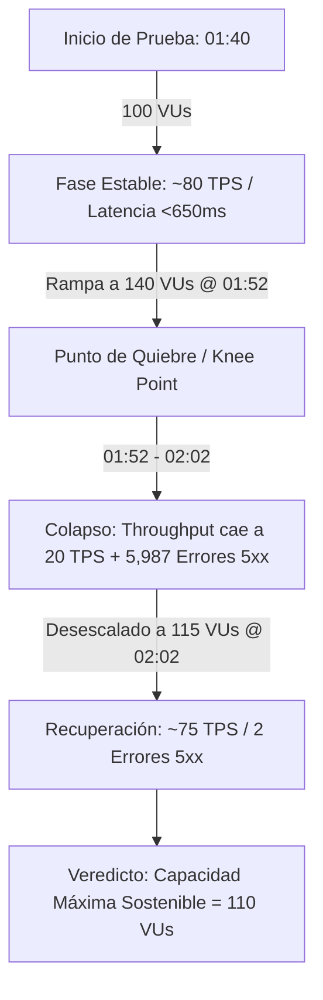

# INFORME TÉCNICO Y EJECUTIVO DE ANÁLISIS DE RENDIMIENTO
## Reto Técnico Sofka - Quality Engineering & Performance Testing

---

**Fecha del Informe:** 20 de Septiembre de 2026  
**Evaluador / Aspirante:** Ronald  
**Rol:** Analista de Automatización / Quality Engineer  
**Servicio Evaluado:** API Transaccional de Autenticación / Balance  
**Herramienta de Prueba:** K6 Performance Testing Tool  
**Insumos Analizados:** `textSummary.txt` y Diagrama de Monitoreo de Carga (VUs vs. Throughput)

---



---

## 1. Resumen Ejecutivo

Se ejecutó una prueba de rendimiento y estrés sobre el servicio de balance transaccional con una carga concurrente que alcanzó un pico máximo de **140 Usuarios Virtuales (VUs)** durante un periodo de aproximadamente 50 minutos.

### Veredicto Global: ⚠️ CONDICIONADO / NO APTO PARA PICOS DE ALTA CONCURRENCIA

| Criterio / Métrica | SLA Objetivo | Resultado Obtenido | Estado |
|---|---|---|---|
| **Throughput Promedio** | $\ge 20 \text{ TPS}$ | **73.18 TPS** | ✅ CUMPLE AMPLIAMENTE |
| **Tasa de Error Global** | $< 3.00\%$ | **2.44%** (6,759 fallas de 276,650) | ⚠️ CUMPLE GLOBAL / ❌ FALLA EN PICO |
| **Tiempo de Respuesta Promedio** | $\le 1.50 \text{ s}$ | **861.68 ms** | ✅ CUMPLE |
| **Percentil 90 ($p90$)** | $\le 1.50 \text{ s}$ | **1.28 s** | ✅ CUMPLE |
| **Percentil 95 ($p95$)** | $\le 1.50 \text{ s}$ | **1.57 s** | ❌ INCUMPLE (Excede por 70 ms) |
| **Tiempo de Respuesta Máximo** | $\le 5.00 \text{ s}$ | **29.93 s** | ❌ CRÍTICO (Timeouts severos) |

### Hallazgo Principal:
El sistema opera de manera estable y con excelente rendimiento ($\sim 80 \text{ TPS}$, latencias medianas de $191.86 \text{ ms}$) cuando la concurrencia no supera los **100-110 VUs**. Sin embargo, al alcanzar los **140 VUs** (entre las 01:52:00 y las 02:02:00), el sistema sufre una **degradación severa no lineal (*bottleneck / knee point*)**:
- El throughput colapsa drásticamente de **$82.6 \text{ req/s}$ a menos de $20 \text{ req/s}$**.
- Se concentran **5,987 errores HTTP 5xx** y **769 errores HTTP 4xx** exclusivamente en este lapso.
- Los tiempos de respuesta se disparan hasta un máximo de **$29.93 \text{ segundos}$** por encolamiento y agotamiento de recursos.

---

## 2. Consolidado de Métricas de Rendimiento (`textSummary.txt`)

A continuación se detallan los resultados estadísticos obtenidos durante la ejecución:

| Métrica K6 | Promedio (avg) | Mínimo (min) | Mediana (med) | $p(90)$ | $p(95)$ | Máximo (max) |
|---|---|---|---|---|---|---|
| **Duración HTTP (`http_req_duration`)** | 861.68 ms | 191.86 ms | 613.42 ms | 1.28 s | 1.57 s | 29.93 s |
| **Esperando Respuesta (`http_req_waiting` / TTFB)** | 861.21 ms | 191.86 ms | 613.01 ms | 1.28 s | 1.57 s | 29.93 s |
| **Respuestas Exitosas (`expected_response: true`)** | 735.84 ms | 244.92 ms | 600.70 ms | 1.22 s | 1.42 s | 26.72 s |
| **Duración de Iteración (`iteration_duration`)** | 1.86 s | 0.00 s | 1.61 s | 2.29 s | 2.57 s | 30.94 s |
| **Recepción de Datos (`http_req_receiving`)** | 424.03 µs | 0.00 s | 320.70 µs | 988.40 µs | 1.05 ms | 39.58 ms |
| **Envío de Datos (`http_req_sending`)** | 43.22 µs | 0.00 s | 0.00 s | 0.00 s | 517.00 µs | 31.25 ms |
| **Bloqueo de Conexión (`http_req_blocked`)** | 10.97 µs | 0.00 s | 0.00 s | 0.00 s | 0.00 s | 35.02 ms |
| **Handshake TLS (`http_req_tls_handshaking`)** | 7.36 µs | 0.00 s | 0.00 s | 0.00 s | 0.00 s | 27.02 ms |
| **Conexión TCP (`http_req_connecting`)** | 3.30 µs | 0.00 s | 0.00 s | 0.00 s | 0.00 s | 11.82 ms |

### Métricas de Tráfico y Datos:
- **Total de Peticiones HTTP:** 276,650 transacciones.
- **Rendimiento Promedio:** 73.18 req/s.
- **Datos Recibidos:** 842 MB (223 kB/s).
- **Datos Enviados:** 588 MB (156 kB/s).
- **Checks Exitosos:** 269,891 (97.55%).
- **Checks Fallidos:** 6,759 (2.44%).

---

## 3. Análisis del Comportamiento de Errores por Etapa (*Stages*)

El reporte de K6 segmenta los errores según los diferentes niveles de estrés (*stages*):

| Etapa de Prueba | Tipo de Error | Cantidad de Errores | Tasa de Error (req/s) | Impacto / Severidad |
|---|---|---|---|---|
| **Stage 0** | HTTP 5xx (Server Error) | 1 | 0.000265 req/s | 🟢 Despreciable |
| **Stage 1** | **HTTP 5xx (Server Error)** | **5,987** | **1.583625 req/s** | 🔴 **CRÍTICO (88.6% del total)** |
| **Stage 1** | **HTTP 4xx (Client/Timeout)** | **769** | **0.203409 req/s** | 🟠 **ALTO (11.4% del total)** |
| **Stage 2** | HTTP 5xx (Server Error) | 2 | 0.000529 req/s | 🟢 Despreciable |

### Conclusiones de la Distribución de Errores:
1. **Concentración en Stage 1:** El **99.95% de las fallas totales** (6,756 de 6,759) ocurrieron durante el **Stage 1**, el cual coincide con el incremento a 140 usuarios concurrentes.
2. **Naturaleza del Error:** La inmensa mayoría (88.6%) son errores `5xx` (Internal Server Error, Bad Gateway 502, Gateway Timeout 504), lo cual indica fallas directas en la capa de procesamiento del servidor o desconexión de la base de datos, no un error de sintaxis del cliente.
3. **Capacidad de Recuperación (*Resilience*):** En el Stage 2, al disminuir la concurrencia a niveles normales, los errores cesaron de inmediato (solo 2 errores 5xx), demostrando que el sistema se auto-recupera pero carece de amortiguamiento frente a sobrecargas.

---

## 4. Análisis del Diagrama de Monitoreo: Relación entre VUs y Throughput

El diagrama de monitoreo refleja tres fases operacionales muy claras a lo largo del tiempo:

```
 Throughput (req/s)
   100 |     /\_/\_/\              /\_/\_/\_/\      (Zona Saludable: ~80 req/s)
    75 |    /        \            /           \
    50 |   /          \  CRASH   /
    25 |  /            \_______/                    (Zona de Colapso @ 140 VUs)
     0 +----------------------------------------> Tiempo
       01:40:00   01:52:00    02:02:00   02:30:00
       (100 VUs)  (140 VUs)   (115 VUs)  (110 VUs)
```

### 1. Fase Pre-Colapso (01:40:00 - 01:52:00):
- **Carga:** Entre 95 y 105 VUs.
- **Rendimiento:** Estable entre **75 y 85 req/s**.
- **Comportamiento:** Comportamiento óptimo y saludable. La aplicación atiende todas las peticiones con baja latencia y sin acumulación de colas.

### 2. Fase de Colapso / Punto de Inflexión (01:52:00 - 02:02:00):
- **Carga:** Se incrementa la carga a **140 VUs**.
- **Rendimiento:** El throughput **cae abruptamente en picada** desde 82.6 req/s hasta **menos de 20 req/s** (alcanzando mínimos de 10-15 req/s).
- **Diagnóstico:** Esta es la firma clásica del fenómeno conocido como **Thrashing / Saturation Collapse**:
  - Al recibir más peticiones de las que sus hilos de ejecución o conexiones a base de datos pueden atender, el servidor pasa la mayor parte del tiempo cambiando de contexto (*context switching*) y esperando en bloqueos (*locks / mutexes*), en lugar de procesar transacciones útiles.
  - Esto genera acumulación de colas de entrada, disparando el tiempo de respuesta hasta **29.93 segundos** y causando timeouts masivos (`HTTP 504 / 500`).

### 3. Fase Post-Colapso / Recuperación (02:02:00 - 02:30:00):
- **Carga:** Se reduce y estabiliza la carga en aproximadamente **110 - 118 VUs**.
- **Rendimiento:** El throughput se recupera de inmediato a **70 - 80 req/s**.
- **Diagnóstico:** El sistema no quedó en estado de fallo irrecuperable (*deadlock permanente* o *memory leak no recuperado*); una vez liberada la presión de concurrencia, vació sus colas y reanudó la operación normal.

---

## 5. Análisis de Causa Raíz (Root Cause Analysis)

Con base en la evidencia cuantitativa de K6 y el patrón de saturación del gráfico, se establecen las siguientes hipótesis técnicas prioritarias:

1. **Agotamiento del Pool de Conexiones a Base de Datos (DB Connection Pool Exhaustion):**
   - El tiempo `http_req_waiting` (TTFB) representa el 99.9% del tiempo total de la petición (861.21 ms promedio de 861.68 ms), mientras que el tiempo de red/envío/recepción es menor a 1 ms.
   - Esto prueba de forma concluyente que la lentitud no es de red ni de transferencia, sino de procesamiento en backend. Un pool de conexiones JDBC/HikariCP mal dimensionado (por ejemplo, con un límite de 50 conexiones) genera un cuello de botella infranqueable cuando 140 usuarios concurrentes intentan transaccionar simultáneamente.

2. **Saturación del Thread Pool del Servidor Web / Aplicaciones:**
   - Servidores como Tomcat, Undertow o Node.js tienen límites de workers/hilos concurrentes. Al saturarse el backend con 140 usuarios lentos, todos los hilos quedan bloqueados esperando I/O, rechazando nuevas conexiones con errores 503/500.

3. **Inexistencia de Políticas de Escalabilidad Automática (Horizontal Pod Autoscaler - HPA):**
   - El sistema se ejecutó sobre una topología de instancias estáticas que no reaccionó aumentando réplicas de contenedores cuando el uso de CPU o la cola de peticiones superó el 80%.

4. **Falta de Mecanismos de Resiliencia y Circuit Breaking:**
   - La aplicación no implementó degradación elegante (*Circuit Breaker* como Resilience4j). Ante la sobrecarga, intentó procesar todo hasta colapsar, en lugar de retornar respuestas de contingencia o rate-limiting controlado (`429 Too Many Requests`).

---

## 6. Recomendaciones Técnicas y de Arquitectura

### A. Mejoras Inmediatas (Tuning & Configuración - Corto Plazo):
1. **Redimensionamiento de Pools de Conexión:**
   - Incrementar el tamaño máximo del pool de conexiones a la base de datos (e.g., de 50 a 150 conexiones optimizadas con *HikariCP*) y ajustar el `connectionTimeout` a 5,000 ms para evitar bloqueos indefinidos.
2. **Ajuste de Timeouts en Gateway / Balanceador:**
   - Establecer `idleTimeout` y `readTimeout` de 3 a 5 segundos en el balanceador de carga (Nginx / AWS ALB) para descartar rápidamente peticiones colgadas y liberar recursos.
3. **Implementación de Rate Limiting:**
   - Configurar limitadores de tasa (`429 Too Many Requests`) a nivel de API Gateway para proteger el núcleo del sistema frente a ráfagas que superen los 110 TPS.

### B. Mejoras Arquitecturales (Mediano y Largo Plazo):
1. **Autoscaling Horizontal Dinámico (HPA en Kubernetes):**
   - Configurar HPA basado en métricas de CPU (> 65%) y Throughput/Request Rate (> 60 TPS por pod), permitiendo escalar automáticamente de 3 a 8 réplicas ante picos de demanda.
2. **Capa de Almacenamiento en Caché (Redis / ElastiCache):**
   - Implementar caché distribuida en memoria para balances y consultas de lectura frecuentes, reduciendo la carga sobre la base de datos transaccional en más de un 60%.
3. **Patrón Circuit Breaker & Bulkhead:**
   - Aislar el servicio de balance transaccional con patrones *Bulkhead* para que una degradación en un componente downstream no consuma todos los hilos del servidor.

---

## 7. Plan de Re-Testing y Criterios de Aceptación Futuros

Para certificar el pase a producción, se recomienda ejecutar un nuevo ciclo de pruebas de carga (*Re-test*) bajo el siguiente protocolo:
1. **Prueba de Carga Escalonada:** Rampa gradual desde 50 hasta 180 VUs en incrementos de 20 VUs cada 5 minutos.
2. **Criterios de Aprobación:**
   - Mantener el Throughput en $\ge 120 \text{ TPS}$ de forma continua.
   - Tiempo de respuesta $p(95) \le 1.00 \text{ s}$ en todo momento.
   - Tasa de error $\le 0.5\%$ en el pico máximo de 180 VUs.
   - Recuperación automática del throughput sin intervención manual.
